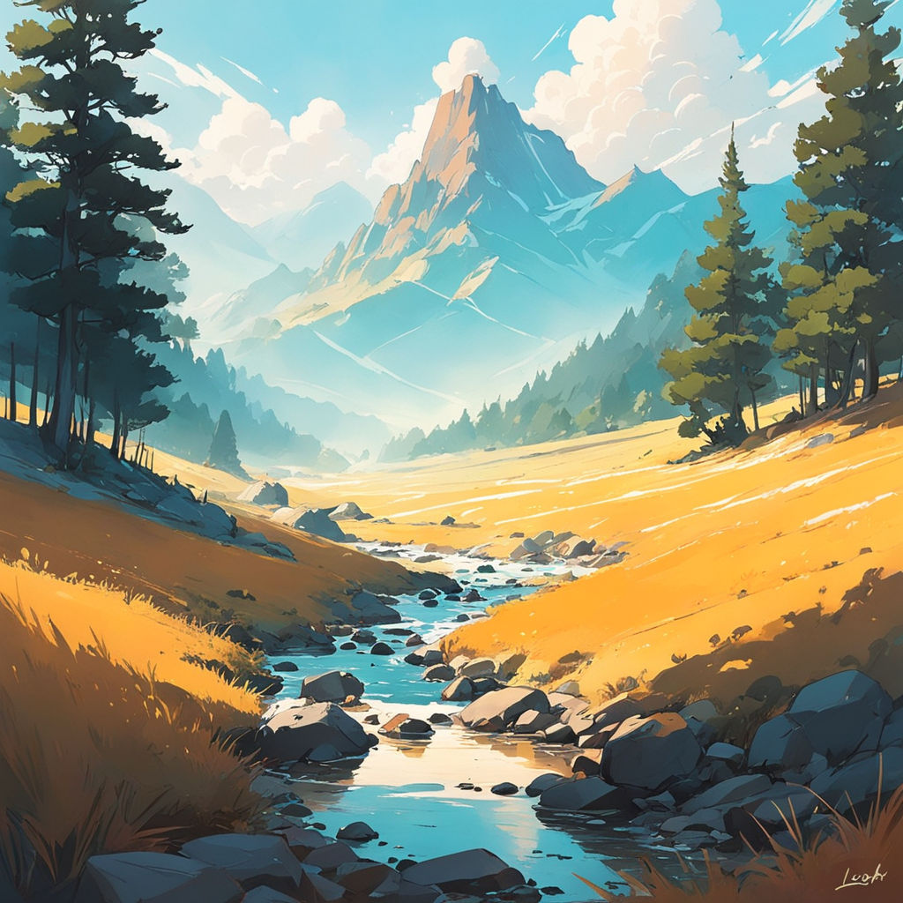

# Image


## Online Resource

```dart
Image(
  image: NetworkImage('https://raw.githubusercontent.com/ruang-belajar/dart-flutter/master/docs/flutter/res/res-1.jpg'),
)
```
---


```dart
Image(
  image: NetworkImage('https://raw.githubusercontent.com/ruang-belajar/dart-flutter/master/docs/flutter/res/res-2.jpg'),
)
```
---


```dart
Image(
  image: NetworkImage('https://raw.githubusercontent.com/ruang-belajar/dart-flutter/master/docs/flutter/res/res-3.jpg'),
)
```
---


```dart
Image(
  image: NetworkImage('https://raw.githubusercontent.com/ruang-belajar/dart-flutter/master/docs/flutter/res/res-4.jpg'),
)
```
---


```dart
Image(
  image: NetworkImage('https://raw.githubusercontent.com/ruang-belajar/dart-flutter/master/docs/flutter/res/res-5.jpg'),
)
```
---


```dart
Image(
  image: NetworkImage('https://raw.githubusercontent.com/ruang-belajar/dart-flutter/master/docs/flutter/res/res-6.jpg'),
)
```
---


```dart
Image(
  image: NetworkImage('https://raw.githubusercontent.com/ruang-belajar/dart-flutter/master/docs/flutter/res/res-7.jpg'),
)
```